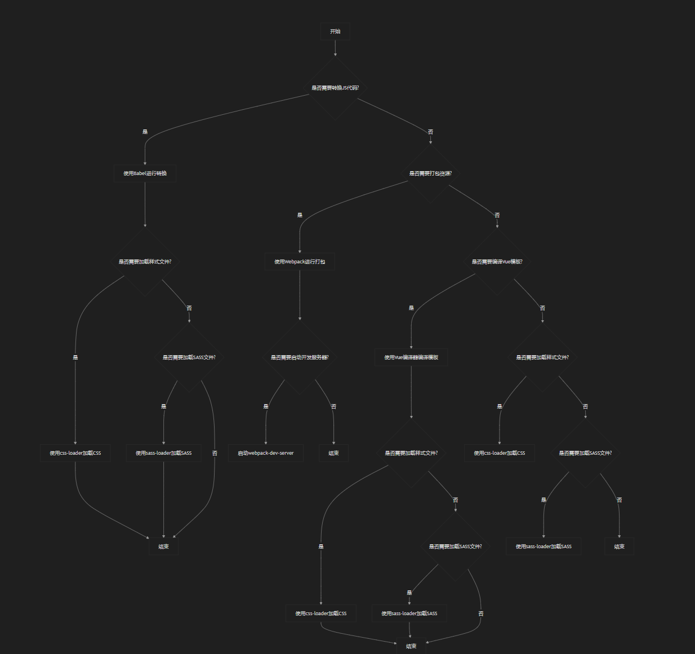

# <center>package说明</center>
```javascript
{
    "name": "@wchbrad/vue-easy-tree",
    "description": "A Vue.js project",
    "version": "1.0.13", // 版本号
    "author": "wchbrad <chao.wu.brad@foxmail.com>",
    "license": "MIT",
    "private": false,
    "main": "./dist/vue-easy-tree.js", // 打包后的文件路径
    "keywords": [
        "virtual",
        "tree",
        "largedata",
        "lazy loading",
        "vue"
    ],
    "publishConfig": {
        "registry": "https://registry.npmjs.org/"
    },
    "scripts": {
        "dev": "cross-env NODE_ENV=development webpack-dev-server --open --hot",
        "build": "cross-env NODE_ENV=production webpack --progress --hide-modules"
    },
    "browserslist": [
        "> 1%",
        "last 2 versions",
        "not ie <= 8"
    ],
    "dependencies": {
        "vue": "2.6.11",
        "vue-virtual-scroller": "~1.0.10"
    },
    "devDependencies": {

        /// Babel的核心库，用于将现代JavaScript代码转换为兼容性更好的代码。
        "@babel/core": "^7.19.3", 

        // 预设配置，自动选择需要的插件以支持目标浏览器或Node.js版本。转码规则(使用preset-env转码规则)
        "@babel/preset-env": "^7.19.4",

        // Webpack加载器，用于在Webpack构建过程中使用Babel编译JavaScript文件。
        "babel-loader": "^8.2.5",

        // 跨平台设置环境变量, Polyfill库，提供对旧版浏览器的支持。
        "core-js": "^3.6.5", 
        
        // 用于跨平台设置环境变量，确保不同操作系统上的一致性。（配置以env.环境英文名文件）
        "cross-env": "^3.1.3",
       
        
        
       
        // 用于编译Vue单文件组件（.vue文件）
        "vue-loader": "^15.7.0",

        // 用于编译Vue模板语法，与vue-loader配合使用。
        "vue-template-compiler": "2.6.11",

        // 用于将Vue模板编译为ES2015兼容的代码。
        "vue-template-es2015-compiler": "^1.6.0",

        // 模块打包工具，将多个模块和其依赖打包成一个或多个bundle文件
        "webpack": "^4.14.0",

        // 命令行工具，用于运行Webpack命令。
        "webpack-cli": "^3.0.8",

        // 开发服务器，提供热更新、实时重载等功能，方便开发调试。
        "webpack-dev-server": "^3.1.11"  // 启动开发服务器
        // 用于生成HTML文件，并自动注入打包后的资源（如CSS、JS）
        "html-webpack-plugin": "^3.2.0",

        // 加载并解析CSS文件，支持处理CSS中的import语句。
        "css-loader": "^2.1.0",

        // 处理非JavaScript资源文件（如图片、字体等），将其复制到输出目录。
        "file-loader": "^1.1.11",

        // 用于解析Sass文件，并将其转换为CSS。
        "sass": "^1.55.0",
        "sass-loader": "^7.1.0",

        // 用于压缩和混淆JavaScript代码，减小文件体积。(生产环境使用)
        "uglifyjs-webpack-plugin": "^2.1.1",  


    }
}
```


